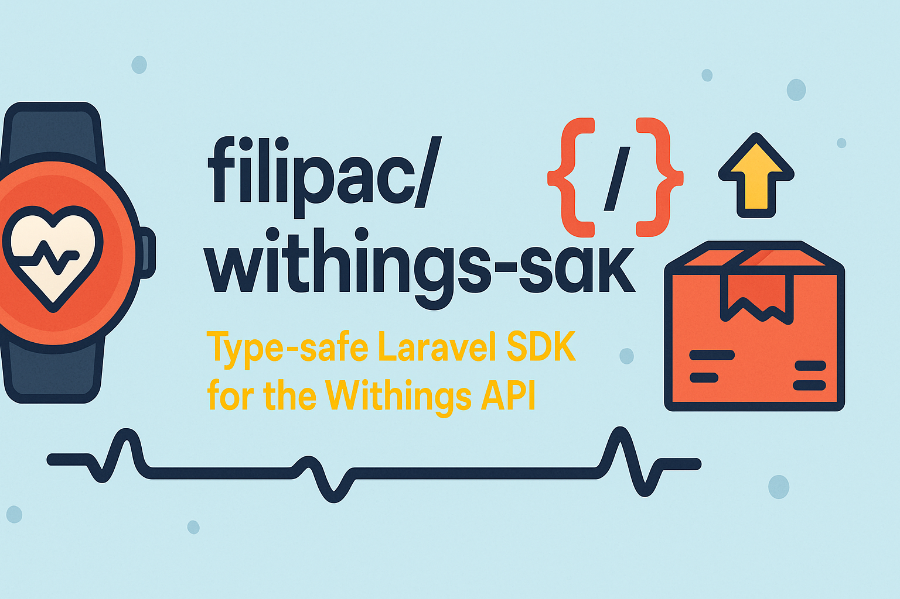

# Withings SDK for Laravel

A comprehensive Laravel package for integrating with the Withings API.

## Features

-   **Complete Withings API Coverage**: All endpoints including measures, heart, sleep, user, notifications, and dropshipment
-   **🎯 Type-Safe PHP 8.1+ Enums**: Eliminates magic strings with dedicated enums for API actions, measurement types, categories, and fields
-   **📦 Laravel Collections**: Fluent data manipulation with Collection methods instead of plain arrays
-   **🔧 Type-Safe Parameter DTOs**: Constructor property promotion with automatic enum conversion
-   **🔐 OAuth2 Authentication Flow**: Full authentication support with token refresh
-   **⚙️ Laravel Service Provider Integration**: Auto-discovery and configuration publishing
-   **🚀 Facade Support**: Clean, Laravel-style API access with full IDE completion
-   **⚡ Comprehensive Error Handling**: Detailed Withings API error mapping
-   **🛡️ Readonly DTOs**: Immutable data objects with automatic type conversion
-   **💪 Enhanced Measurement Types**: Support for all Withings measurement types with enum-based categorization

## Installation

Add the package to your Laravel project:

```bash
composer require filipac/withings-sdk
```

## Configuration

Publish the configuration file:

```bash
php artisan vendor:publish --tag=withings-config
```

Add your Withings API credentials to your `.env` file:

```env
WITHINGS_CLIENT_ID=your_client_id
WITHINGS_CLIENT_SECRET=your_client_secret
WITHINGS_ACCESS_TOKEN=your_access_token
WITHINGS_REFRESH_TOKEN=your_refresh_token
```

## Usage

### Basic Usage

```php
use Filipac\Withings\Client\WithingsClient;
use Filipac\Withings\DataTransferObjects\Parameters\GetMeasuresParams;
use Filipac\Withings\Enums\MeasurementType;

// Create client with tokens
$client = new WithingsClient(
    accessToken: 'your_access_token',
    refreshToken: 'your_refresh_token',
    clientId: 'your_client_id',
    clientSecret: 'your_client_secret'
);

// 🎯 Type-safe enums eliminate magic strings
$params = new GetMeasuresParams(
    meastype: MeasurementType::WEIGHT, // Enum instead of magic number
    startdate: strtotime('2024-01-01'),
    enddate: strtotime('2024-12-31')
);

// Or use convenience factory methods
$params = GetMeasuresParams::forWeight(
    strtotime('2024-01-01'),
    strtotime('2024-12-31')
);

$measurementData = $client->measures()->getMeasures($params);

// 📦 Get Laravel Collections instead of arrays
$weightMeasurements = $measurementData->getWeightMeasurements(); // Collection
$latestWeight = $measurementData->getLatestMeasurement(MeasurementType::WEIGHT); // Single measurement

// Individual measurements are automatically converted to enums
$measurement = $weightMeasurements->first();
echo $measurement->type->getName(); // "Weight" (from enum)
echo $measurement->type->getUnit(); // "kg" (from enum)
echo $measurement->category?->getName(); // "Real measurement" (from enum)
```

### Using the Facade (with Full IDE Completion)

```php
use Filipac\Withings\Facades\Withings;
use Filipac\Withings\Enums\NotificationApplication;
use Filipac\Withings\Enums\MeasurementType;

// Full IDE autocompletion for all methods
$measurements = Withings::measures()->getWeight();

// Type-safe enum parameters with IDE hints
Withings::notifications()->subscribe(
    'https://your-webhook-url.com',
    NotificationApplication::WEIGHT,
    'My webhook comment'
);

// Access all services with complete method documentation
$heartData = Withings::heart()->getHeartRate();
$sleepSummary = Withings::sleep()->getSummary();
$userInfo = Withings::user()->getInfo();
```

The facade provides complete IDE autocompletion with:

-   ✅ **Method signatures** with parameter types and return types
-   ✅ **Enum suggestions** for type-safe parameters
-   ✅ **Documentation** with usage examples
-   ✅ **Service method chaining** with full completion at each step

### 🎯 Type-Safe Enums

All magic strings and numbers are replaced with type-safe enums:

```php
use Filipac\Withings\Enums\{MeasurementType, MeasurementCategory, NotificationApplication, SleepField};

// ✅ Type-safe measurement types
$weight = MeasurementType::WEIGHT;
$bodyFat = MeasurementType::FAT_RATIO;
$heartRate = MeasurementType::HEART_RATE;

// ✅ Type-safe categories
$realMeasurement = MeasurementCategory::REAL;
$manualEntry = MeasurementCategory::MANUAL;

// ✅ Type-safe notification types
$weightNotifications = NotificationApplication::WEIGHT;

// ✅ Type-safe sleep fields
$sleepFields = [SleepField::DEEP_SLEEP_DURATION, SleepField::REM_SLEEP_DURATION];

// Get enum information
echo MeasurementType::WEIGHT->getName(); // "Weight"
echo MeasurementType::WEIGHT->getUnit(); // "kg"
echo MeasurementCategory::REAL->getDescription(); // "Real measurement taken by device"
```

### 📦 Laravel Collections

All data methods return Laravel Collections for powerful data manipulation:

```php
$measurements = Withings::measures()->getWeight()->getMeasurements(); // Collection<Measurement>

// ✅ Fluent filtering and chaining
$recentWeights = $measurements
    ->filter(fn($m) => $m->type === MeasurementType::WEIGHT)
    ->sortByDesc('date')
    ->take(10)
    ->map(fn($m) => [
        'weight' => $m->getRealValue(),
        'date' => $m->getDateTime()->format('Y-m-d'),
        'category' => $m->category?->getName()
    ]);

// ✅ Powerful aggregations
$averageWeight = $measurements->avg('value') * pow(10, -3); // Convert to kg
$weightTrend = $measurements->pluck('value', 'date');

// ✅ Activity data with Collections
$activities = Withings::measures()->getActivity()->getActivities();
$totalSteps = $activities->sum('steps');
$averageDailySteps = $activities->groupBy('date')->map->sum('steps')->avg();

// ✅ Collection-specific methods
$activitiesByDate = $activities->getActivitiesGroupedByDate();
$weeklyAverage = $activities->getAverageDailySteps();
```

### OAuth2 Flow

```php
// Generate authorization URL
$authUrl = $client->oauth2()->getAuthorizationUrl(
    redirectUri: 'https://your-app.com/callback',
    state: 'optional-state',
    scopes: ['user.info', 'user.metrics']
);

// Exchange code for tokens
$tokens = $client->oauth2()->getAccessToken($code, $redirectUri);

// Refresh tokens
$refreshedTokens = $client->oauth2()->refreshToken();
```

### Available Services

#### Measure Service

-   `getMeasures(?GetMeasuresParams $params)` - Get body measurements with type-safe parameters
-   `getWeight(?int $startdate, ?int $enddate, ?int $lastupdate)` - Get weight measurements
-   `getHeight(?int $startdate, ?int $enddate)` - Get height measurements
-   `getBodyComposition(?int $startdate, ?int $enddate)` - Get body composition data
-   `getVitalSigns(?int $startdate, ?int $enddate)` - Get blood pressure and heart rate
-   `getTemperature(?int $startdate, ?int $enddate)` - Get temperature measurements
-   `getActivityMeasures(?GetActivityParams $params)` - Get activity data
-   `getWorkouts(?GetWorkoutsParams $params)` - Get workout data
-   `getIntradayActivity(?GetIntradayActivityParams $params)` - Get detailed activity data

#### Heart Service

-   `getHeartRate(?GetHeartParams $params)` - Get heart rate data with parameters
-   `list(?int $startdate, ?int $enddate)` - List heart rate measurements
-   `getEcg(int $signalid)` - Get ECG data by signal ID
-   `getDetailed(?int $startdate, ?int $enddate, ?int $offset)` - Get detailed heart data

#### Sleep Service

-   `getSummary(?GetSleepParams $params)` - Get sleep summary with parameters
-   `get(?GetSleepParams $params)` - Get detailed sleep data with parameters
-   `getSummaryByDateRange(string $startdateymd, string $enddateymd)` - Get sleep summary for date range (Y-m-d format)
-   `getByDateRange(int $startdate, int $enddate)` - Get detailed sleep data for date range (Unix timestamps)
-   `getSleepWithFields(array $dataFields, ?int $startdate, ?int $enddate)` - Get specific sleep fields

#### User Service

-   `getInfo()` - Get user information
-   `getDevices()` - Get user devices
-   `getGoals()` - Get user goals
-   `getTimezone()` - Get user's timezone
-   `getPreferences()` - Get user preferences

#### Notification Service

-   `subscribe(string $callbackurl, ?string $comment, int $appli)` - Subscribe to notifications
-   `revoke(string $callbackurl, int $appli)` - Revoke notifications
-   `get(?int $appli)` - Get notification information
-   `list()` - List all notifications

#### Dropshipment Service

-   `createOrder(array $orderData)` - Create a new dropshipment order
-   `updateOrder(string $orderId, array $updateData)` - Update existing order
-   `getOrder(string $orderId)` - Get order details
-   `listOrders(array $filters)` - List orders with filters
-   `cancelOrder(string $orderId)` - Cancel an order
-   `getProducts()` - Get available products
-   `getShippingMethods(array $shippingData)` - Get shipping options

## 🛡️ Enhanced Data Transfer Objects

The package includes immutable DTOs with automatic type conversion and Collection support:

```php
use Filipac\Withings\Enums\MeasurementType;
use Filipac\Withings\DataTransferObjects\Parameters\GetMeasuresParams;

// 🔧 Type-safe parameter creation with factory methods
$params = GetMeasuresParams::forBodyComposition(
    startdate: strtotime('-30 days'),
    enddate: time()
);

$measurementData = $client->measures()->getMeasures($params);

// 📦 Get Collection instead of array
$measurements = $measurementData->getMeasurements(); // Collection<Measurement>

// 🎯 Automatic enum conversion - no more magic numbers!
$measurement = $measurements->first();
echo $measurement->type; // MeasurementType::WEIGHT (enum)
echo $measurement->category; // MeasurementCategory::REAL (enum)

// ✅ Rich enum methods
echo $measurement->type->getName(); // "Weight"
echo $measurement->type->getUnit(); // "kg"
echo $measurement->category?->getDescription(); // "Real measurement taken by device"

// 📊 Collection-powered analysis
$bodyCompositionData = $measurements
    ->filter(fn($m) => $m->isBodyComposition())
    ->sortByDesc('date')
    ->groupBy(fn($m) => $m->getDateTime()->format('Y-m'))
    ->map(fn($monthlyData) => [
        'count' => $monthlyData->count(),
        'avg_value' => $monthlyData->avg('value'),
        'types' => $monthlyData->pluck('type')->unique()->map->getName()
    ]);

// 🎯 Type-safe filtering with enums
$weightMeasurements = $measurementData->getMeasurementsByType(MeasurementType::WEIGHT);
$latestWeight = $measurementData->getLatestMeasurement(MeasurementType::WEIGHT);
```

## ⚡ Error Handling

```php
use Filipac\Withings\Exceptions\WithingsException;

try {
    $measurements = Withings::measures()->getWeight(); // Using facade
} catch (WithingsException $e) {
    echo "Withings API Error: " . $e->getMessage();
    echo "Status Code: " . $e->getCode();
}
```

## 🚀 What Makes This Package Special

### ✅ Complete Type Safety

-   **No magic strings or numbers** - Everything uses PHP 8.1+ enums
-   **Automatic type conversion** - Raw API responses become typed objects
-   **Full IDE completion** - Autocomplete for all methods, parameters, and enum values

### ✅ Laravel-First Design

-   **Collections everywhere** - Powerful data manipulation with Collection methods
-   **Service provider integration** - Auto-discovery and configuration publishing
-   **Facade support** - Clean, Laravel-style static access
-   **Follows Laravel conventions** - Feels native to Laravel applications

### ✅ Developer Experience

-   **Rich factory methods** - `GetMeasuresParams::forWeight()`, `::forBodyComposition()`
-   **Fluent data analysis** - Chain filters, sorts, and aggregations
-   **Comprehensive error handling** - Detailed Withings API error mapping
-   **Immutable DTOs** - Readonly objects prevent accidental mutations

### ✅ Production Ready

-   **Complete API coverage** - All Withings endpoints supported
-   **Robust authentication** - Full OAuth2 flow with token refresh
-   **Extensible design** - Easy to add custom methods and functionality
-   **Well documented** - Comprehensive examples and use cases

## Testing

This package uses [Pest](https://pestphp.com/) for testing. To run the tests:

```bash
# Run all tests
composer test

# Run tests with coverage
composer test-coverage

# Run specific test file
./vendor/bin/pest tests/Unit/WithingsClientTest.php

# Run tests in watch mode (if pest-plugin-watch is installed)
./vendor/bin/pest --watch
```

### Test Structure

- **Unit Tests** (`tests/Unit/`): Test individual classes and methods in isolation
- **Feature Tests** (`tests/Feature/`): Test integration with Laravel framework and service provider
- **Test Helpers** (`tests/Pest.php`): Custom expectations and helper functions

Example test:

```php
it('can create a withings client instance', function () {
    $client = new WithingsClient(
        clientId: 'test-client-id',
        clientSecret: 'test-client-secret'
    );

    expect($client)->toBeWithingsClient();
});
```

### Custom Expectations & Test Helpers

The package includes custom Pest expectations and testing utilities:

- `toBeWithingsClient()` - Verify instance is a WithingsClient
- `mockWithingsResponse()` - Helper to create consistent mock API responses
- `createMockClient()` - Helper to create HTTP-mocked WithingsClient instances

### Test Coverage

The package includes **42+ comprehensive tests** (85+ assertions) covering:

- ✅ **Unit Tests** - All services, DTOs, enums, and client functionality
- ✅ **Feature Tests** - Laravel integration and service provider  
- ✅ **Integration Tests** - Complete OAuth workflows and API interactions
- ✅ **Performance Tests** - Large dataset handling and memory efficiency
- ✅ **Edge Case Tests** - Error conditions and boundary scenarios
- ✅ **Architecture Tests** - Code quality and structural integrity

**Test Categories:**
- Client & Core Functionality: 7 tests
- Service Layer (Measures, User, Notifications, Heart): 17 tests
- Data Transfer Objects: 8 tests  
- Enums & Types: 4 tests
- Laravel Integration: 4 tests
- Performance & Memory: 6 tests

### Testing Infrastructure

**HTTP Client Mocking**: The `WithingsClient` includes public `setHttpClient()` and `getHttpClient()` methods specifically designed for testing, allowing easy injection of mock HTTP clients without complex reflection.

## Requirements

-   PHP 8.2+
-   Laravel 10.0+
-   Guzzle 7.0+

## License

MIT
